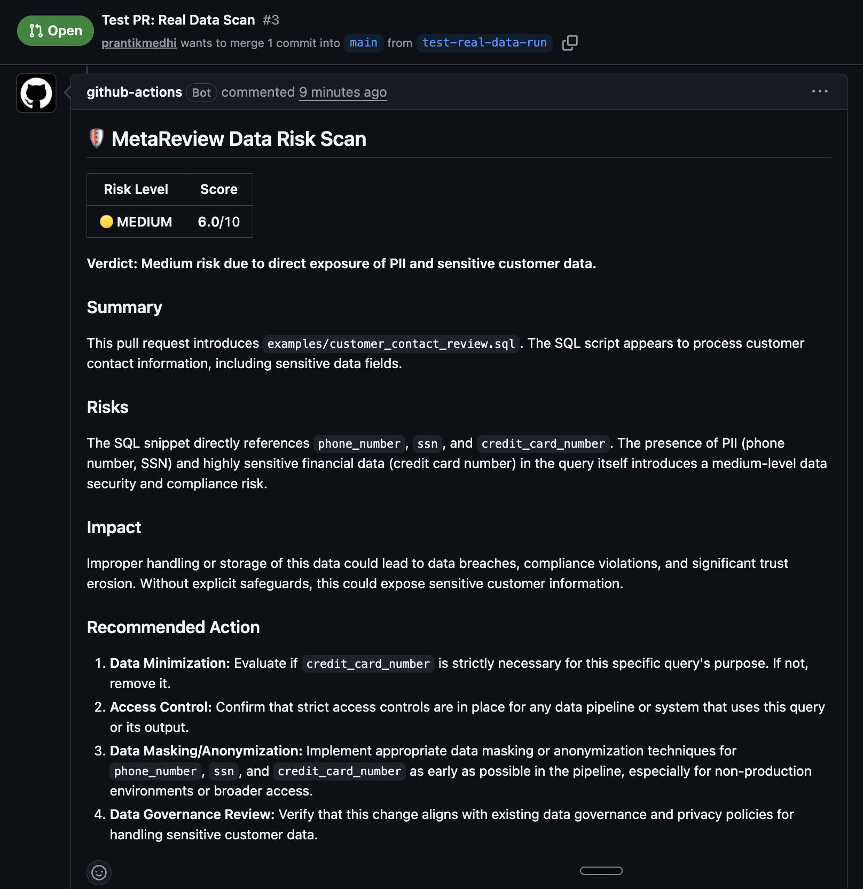
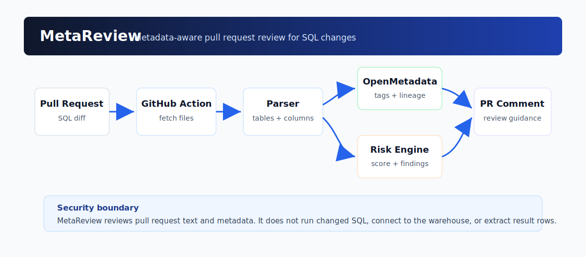
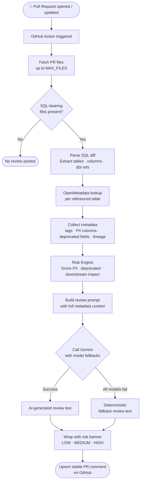

<div align="center">
  <h1>MetaReview 🛡️</h1>
  <p><b>Metadata-aware pull request guardrail for data engineering teams.</b></p>
  
  <br />
  <br />
  
</div>

<br/>

MetaReview reviews SQL-bearing pull requests, enriches the diff with OpenMetadata table context, scores data-change risk, and posts an actionable review comment back to GitHub.

MetaReview **does not** execute pull request SQL and **does not** extract warehouse rows. It operates purely on GitHub diffs, metadata APIs, and generated reviewer guidance.

## What It Does

- Detects SQL additions in `.sql`, dbt-oriented, and SQL-like text files.
- Extracts referenced tables, dbt `ref()` / `source()` calls, and qualified columns.
- Looks up OpenMetadata table, column, tag, and lineage context.
- Flags sensitive fields, deprecated columns, and downstream impact.
- Generates a concise review with Gemini, with deterministic fallback text when AI generation is unavailable.
- Upserts one stable GitHub PR comment instead of creating duplicates.

## System Flow

<p align="center">
  
</p>



## Architecture

| Layer | Responsibility | Key files |
|---|---|---|
| GitHub integration | Fetch PR files and upsert review comments | `src/metareview/github_client.py` |
| SQL parser | Extract changed SQL, table names, dbt refs, and column refs | `src/metareview/parsing.py` |
| Metadata client | Query OpenMetadata table and lineage APIs | `src/metareview/metadata.py` |
| Risk engine | Score PII, deprecated fields, and downstream exposure | `src/metareview/review.py` |
| Runtime entrypoint | Orchestrate fetch, enrichment, scoring, and comment publishing | `src/metareview/main.py` |

## Repository Layout

```text
.github/workflows/metareview.yml             Hosted GitHub Action workflow
.github/workflows/metareview-self-hosted.yml Manual workflow for local OpenMetadata deployments
docs/metareview-flow.svg                     Architecture diagram
examples/customer_contact_review.sql         Example SQL change for validation
src/metareview/                              Runtime package
tests/                                      Unit tests
SETUP.md                                    Deployment and operating guide
```

## Quick Start

1. Configure repository secrets:

   | Secret | Description |
   |---|---|
   | `GEMINI_API_KEY` | Gemini API key used for review text generation |
   | `OPENMETADATA_URL` | OpenMetadata base URL, for example `https://sandbox.open-metadata.org` |
   | `OPENMETADATA_JWT_TOKEN` | OpenMetadata personal access token |

2. Optionally configure repository variables:

   | Variable | Default |
   |---|---|
   | `OPENMETADATA_VERIFY_SSL` | `true` |
   | `OPENMETADATA_MAX_DOWNSTREAM_DEPTH` | `2` |
   | `METAREVIEW_MODEL` | `gemini-2.5-flash` |
   | `METAREVIEW_MAX_FILES` | `25` |

3. Open a pull request that changes SQL or dbt model content.

4. Wait for `MetaReview PR Guardrail` to finish.

5. Review the generated PR comment with impact score, detected risks, and recommended actions.

## Example SQL Change

```sql
select
  customer_id,
  email,
  phone_number
from acme_nexus_raw_data.acme_raw.crm.customers
where email is not null;
```

MetaReview reads this SQL from the PR diff, identifies sensitive fields, looks up the referenced table in OpenMetadata, and posts a review without running the query.

## Local Run

```bash
python3 -m venv .venv
source .venv/bin/activate
pip install -r requirements.txt

export GITHUB_TOKEN=ghp_xxx
export GITHUB_REPOSITORY=owner/repo
export PR_NUMBER=12
export GEMINI_API_KEY=xxx
export OPENMETADATA_URL=https://sandbox.open-metadata.org
export OPENMETADATA_JWT_TOKEN=xxx
export OPENMETADATA_VERIFY_SSL=true
export METAREVIEW_MODEL=gemini-2.5-flash

PYTHONPATH=src python3 -m metareview.main
```

## Operational Notes

- Use `.github/workflows/metareview.yml` for hosted OpenMetadata or internet-reachable OpenMetadata deployments.
- Use `.github/workflows/metareview-self-hosted.yml` only when OpenMetadata is reachable from a self-hosted runner.
- Store tokens only in GitHub secrets or local environment variables.
- Keep `METAREVIEW_MAX_FILES` bounded for predictable API runtime.
- Treat Gemini output as reviewer assistance; policy enforcement should remain deterministic if blocking merges is added later.

## Verification

Run unit tests locally:

```bash
PYTHONPATH=src python3 -B -m unittest discover -s tests -v
```

Current coverage validates:

- GitHub API pagination and stable comment upserts
- OpenMetadata URL and response-shape handling
- SQL, quoted identifier, and dbt macro parsing
- Risk scoring for sensitive columns and unrelated-table false positives

## Security Model

MetaReview is designed as a pre-merge reviewer, not a data extractor.

- Reads GitHub PR metadata and patches.
- Calls OpenMetadata metadata APIs.
- Posts GitHub issue comments.
- Does not run changed SQL.
- Does not connect to the warehouse.
- Does not copy result rows or expose data samples.

## Roadmap

- Policy mode for merge-blocking rules
- Repository-level configuration file
- Inline review comments for exact SQL lines
- Slack or Teams notification integration
- Expanded dbt manifest support
